

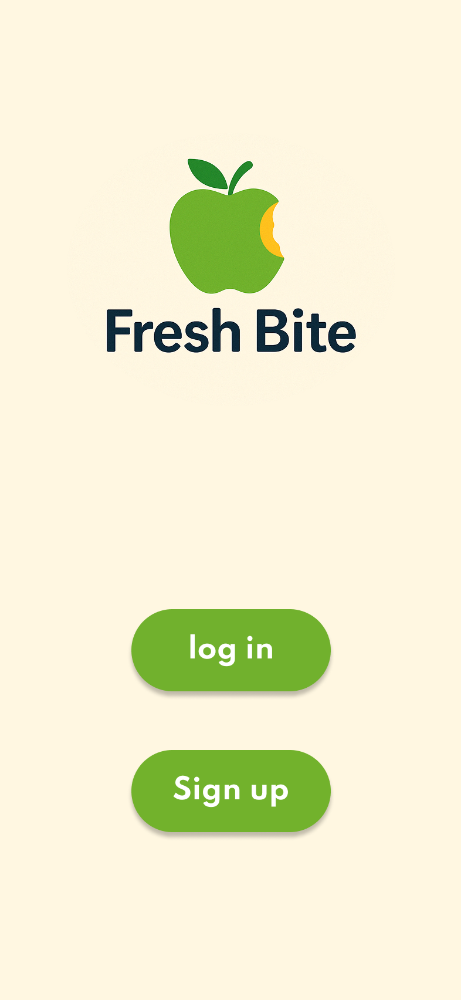

# 🥗 Fresh Bite

### Fresh Bite, Fresh Start!

*A mobile app concept that makes healthy eating effortless through smart recipes, ingredient swaps, and calorie tracking.*

---

## 📖 About the Project

**Fresh Bite** was created to solve a real-world problem: *eating healthy shouldn't be hard.*

With fast, flexible recipes, smart ingredient swaps, and effortless calorie tracking, Fresh Bite empowers users to take control of their health. Whether you're a beginner cook or just busy, Fresh Bite makes healthy eating achievable and enjoyable.

Our goal is to help users easily integrate healthier meals into their daily lives — without stress.

---

## 🎯 Target Users

- 💪 **Healthy lifestyle members** looking to maintain their routine
- 🍳 **Beginner cooks** who need guidance and confidence in the kitchen
- 🥜 **People with allergies** who need safe ingredient alternatives
- 🏋️ **Athletes** tracking calories and macros for performance goals
- ⏰ **Busy individuals** who want fast, nutritious meal ideas

---

## ❓ Problems We're Solving

- Difficulty completing recipes due to **missing ingredients**
- Challenges finding **safe substitutes** for allergies or dietary needs
- Difficulty in finding **quick, healthy meal ideas** for daily life
- Need for **simple nutritional tracking** and guidance, especially for beginners

---

## 🔍 Our Research

We collected user insights through **structured interviews** with 5 users from different backgrounds (a home cook, an allergy sufferer, a gym athlete, a calorie tracker, and a beginner cook) and **distributed a questionnaire** to understand daily food habits, cooking challenges, and health goals more broadly.

Key findings shaped our three core features:
- 🚀 **Simplicity & Speed** — Busy users want fast, easy recipes with clear steps
- 📊 **Nutrition Tracking** — All users value accurate calorie and nutrition tracking
- 🎨 **Personalization** — Recipes tailored to goals, ingredients, and dietary needs

---

## ✨ Core Features

### 🍳 Cooking 101 — Learn & Cook with Confidence
Beginner-friendly tutorials, ready-made healthy recipes, and the ability to build custom recipes from ingredients you have at home.

### 🔄 AltEats — Smart Ingredient Swaps
Find healthier, allergy-safe, or available-at-home alternatives for any ingredient in seconds.

### 📈 TrackYourCal — Effortless Calorie Tracking
Log your meals, get accurate calorie and macro breakdowns, and receive personalized feedback to stay on track with your goals.

---

## 📱 Prototype Walkthrough

### 🔐 Onboarding

<table>
  <tr>
    <td align="center"> <b>Welcome</b></td>
    <td align="center">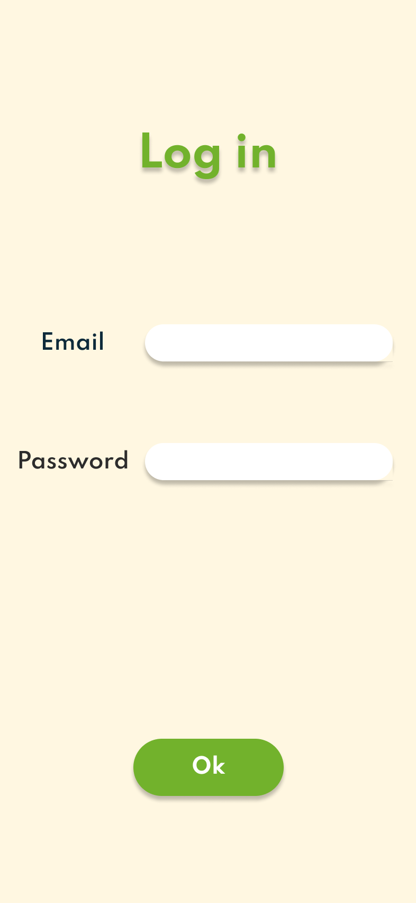 <b>Log In</b></td>
    <td align="center">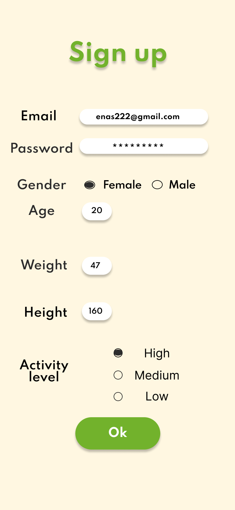 <b>Sign Up</b></td>
  </tr>
</table>

### 🏠 Home & Navigation

<table>
  <tr>
    <td align="center">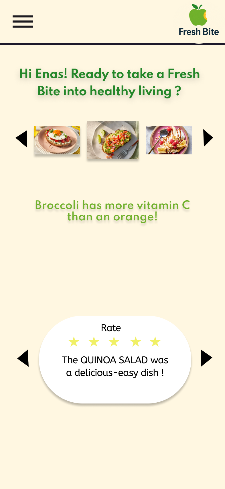 <b>Home Page</b></td>
    <td align="center">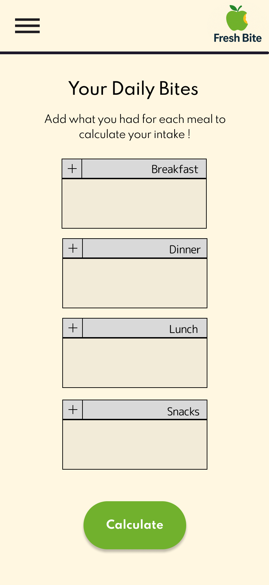 <b>Side Menu</b></td>
    <td align="center">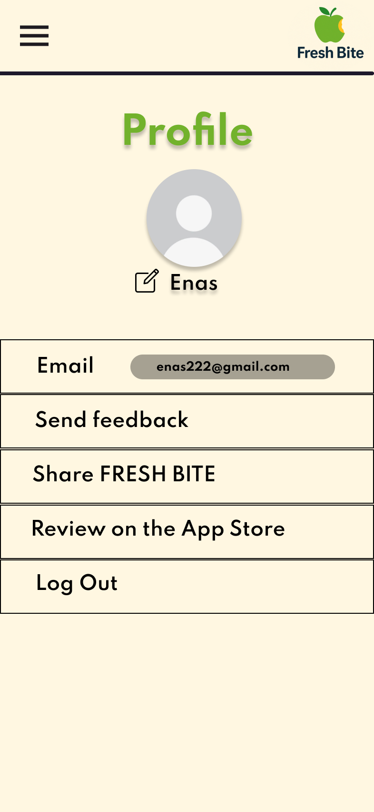 <b>Profile</b></td>
  </tr>
</table>

### 🍳 Task 1 — Cooking 101

<table>
  <tr>
    <td align="center">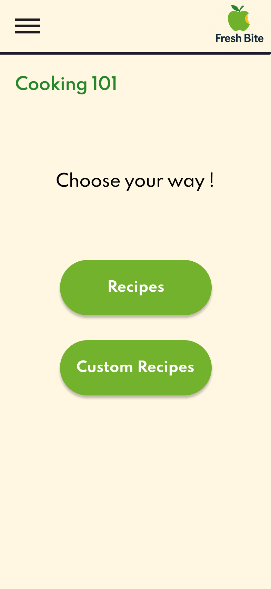 <b>Choose Your Way</b></td>
    <td align="center">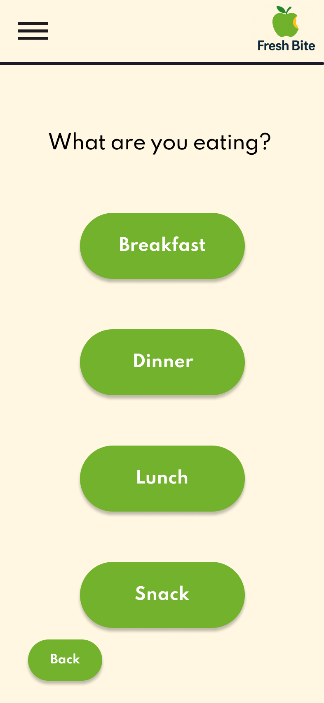 <b>Meal Time</b></td>
    <td align="center">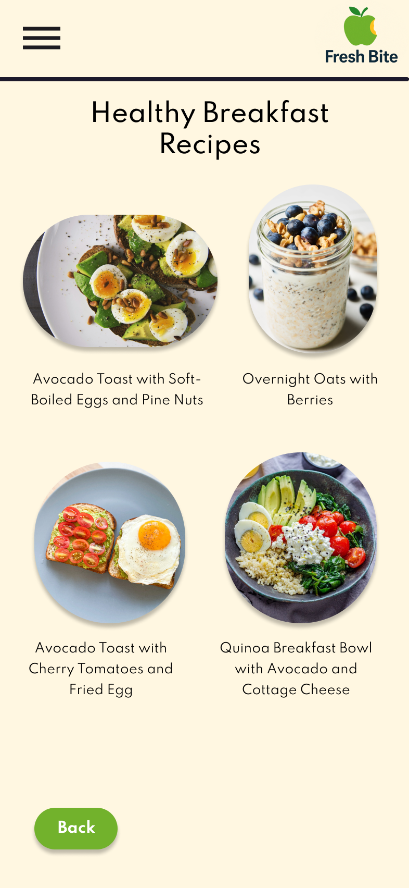 <b>Recipes</b></td>
  </tr>
  <tr>
    <td align="center">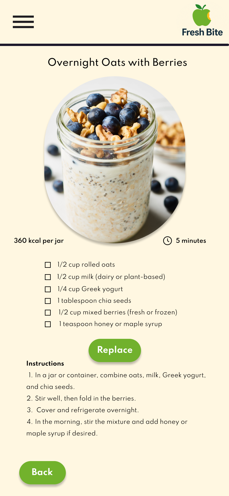 <b>Recipe Detail</b></td>
    <td align="center">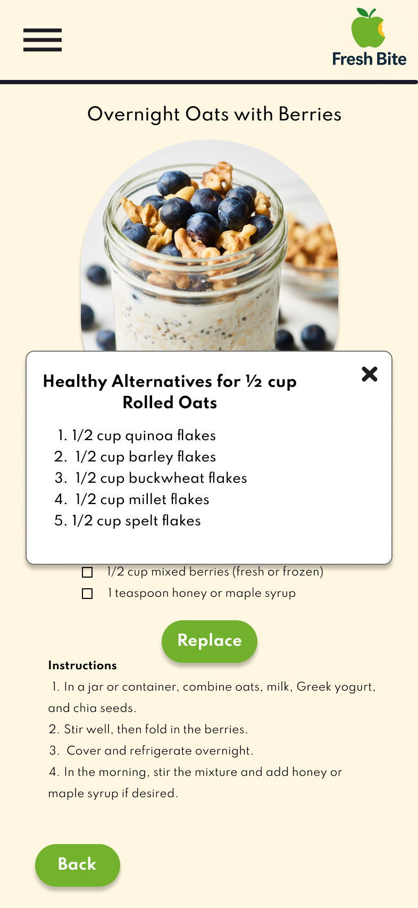 <b>Ingredient Replace</b></td>
    <td align="center">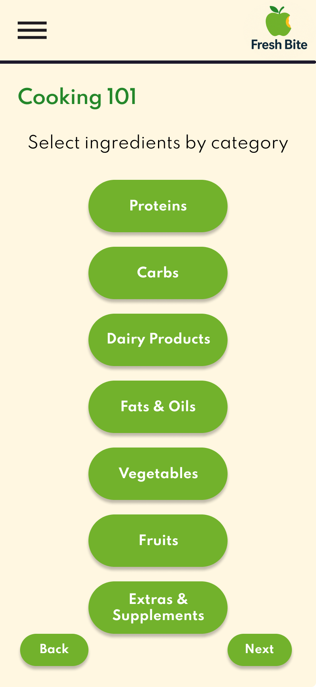 <b>Custom Categories</b></td>
  </tr>
  <tr>
    <td align="center" colspan="3">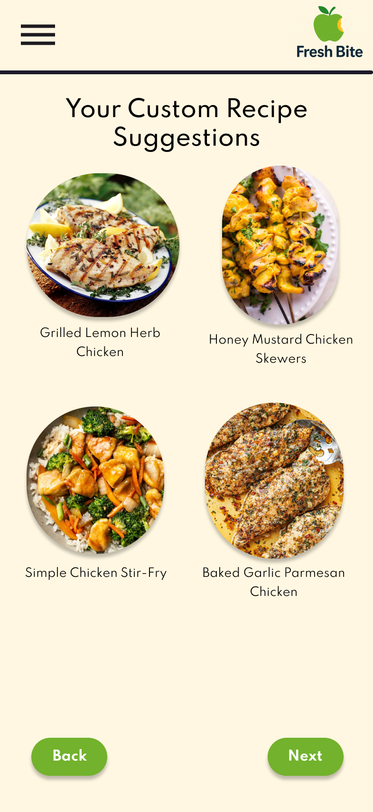 <b>Custom Recipe Suggestions</b></td>
  </tr>
</table>

### 🔄 Task 2 — AltEats

<table>
  <tr>
    <td align="center">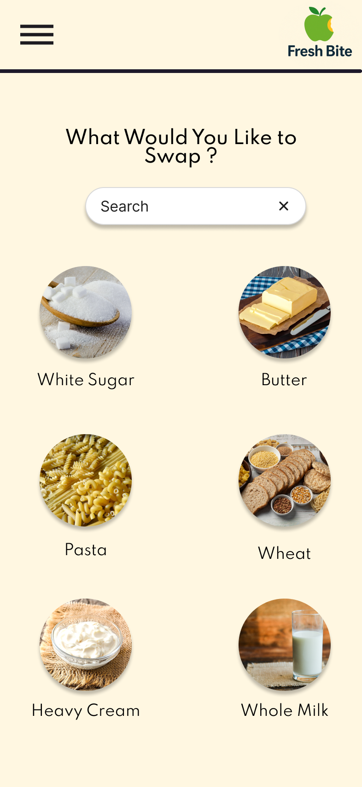 <b>What to Swap?</b></td>
    <td align="center">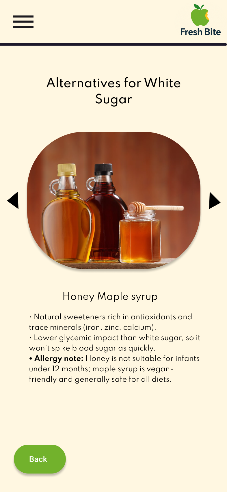 <b>Alternative Details</b></td>
  </tr>
</table>

### 📈 Task 3 — TrackYourCal

<table>
  <tr>
    <td align="center">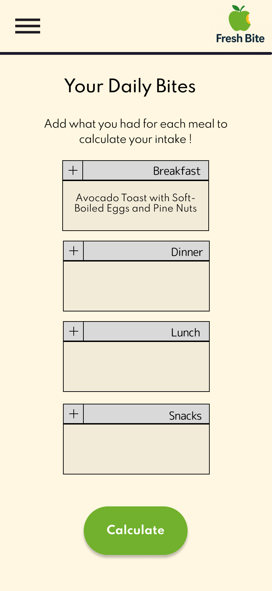 <b>Daily Bites Input</b></td>
    <td align="center">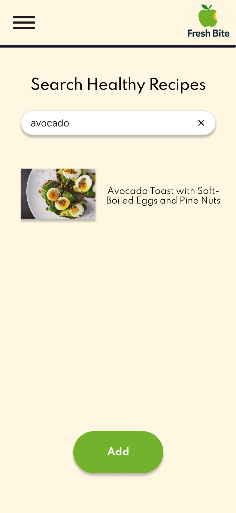 <b>Search Recipes</b></td>
    <td align="center">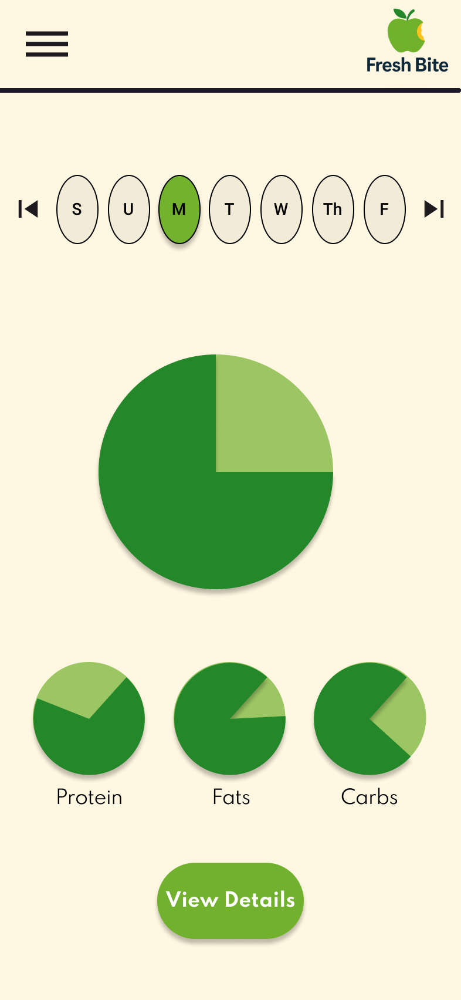 <b>Macro Breakdown</b></td>
  </tr>
  <tr>
    <td align="center">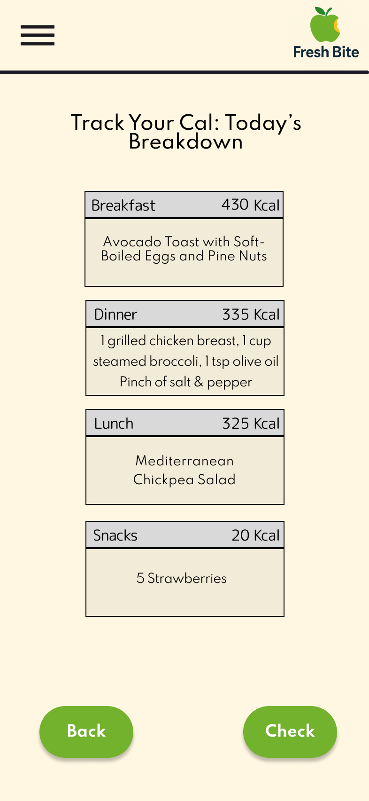 <b>Meal Breakdown</b></td>
    <td align="center">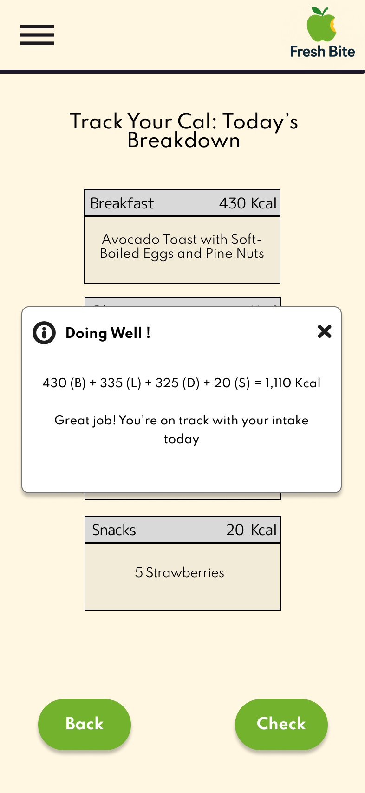 <b>Personalized Feedback</b></td>
  </tr>
</table>

---

## 🎨 Live Interactive Prototype

> Want to click through it yourself? Check out the full interactive prototype on Figma:

### 👉 [**Open in Figma**](https://www.figma.com/design/B9f6s0EzBvqXYGcuk4YoiZ/Project-HCI?node-id=0-1&t=Xh94u5Arv6sluJd7-1)

---

## 🧠 HCI Principles Applied

| Principle | How We Applied It |
|---|---|
| 🎯 **Consistency** | Uniform design across all pages — predictable navigation and interactions |
| ⚡ **Feedback** | Instant system responses (e.g., suggested alternatives appear immediately on swap) |
| 🛡️ **Error Prevention** | Disabled "Replace" button until a valid selection is made — preventing accidental clicks |
| 🔀 **Flexibility & Efficiency** | Beginners follow step-by-step recipes; experienced users build custom meals quickly |
| 👤 **User-Centered Design** | Every feature was built directly from real user needs uncovered in interviews |

---

## 💡 Why Fresh Bite Matters

- 🥗 **Simplifies healthy eating** — Quick, nutritious recipes within easy reach
- 🎨 **Personalized experience** — Meal and ingredient suggestions based on goals and dietary needs
- ⏱️ **Saves time and effort** — Easy steps and smart ingredient swaps
- 🎯 **Supports health goals** — Tracks calories and macros to meet fitness targets
- 🌱 **Encourages a healthy lifestyle** — Empowers beginners and busy people to eat better without stress

---

## 📑 Documentation

📂 See the full [**Project Presentation**](docs/Fresh_Bite_Presentation.pdf) for the complete design walkthrough, interview analysis, and HCI principles breakdown.

---

## 👥 Team — Group 6

This project was designed and built by:

-  **Enas Alqarni**
-  **Jana Akkad**
-  **Lamis Alghamdi**
-  **Reema Alqarni**
-  **Abrar Alharbi**

**Course:** CCSW-225 — Human-Computer Interaction

---

### 🍎 Don't forget to eat well today!

*Fresh Bite isn't just about food — it's about making healthy living easier, more accessible, and more enjoyable for everyone.*

